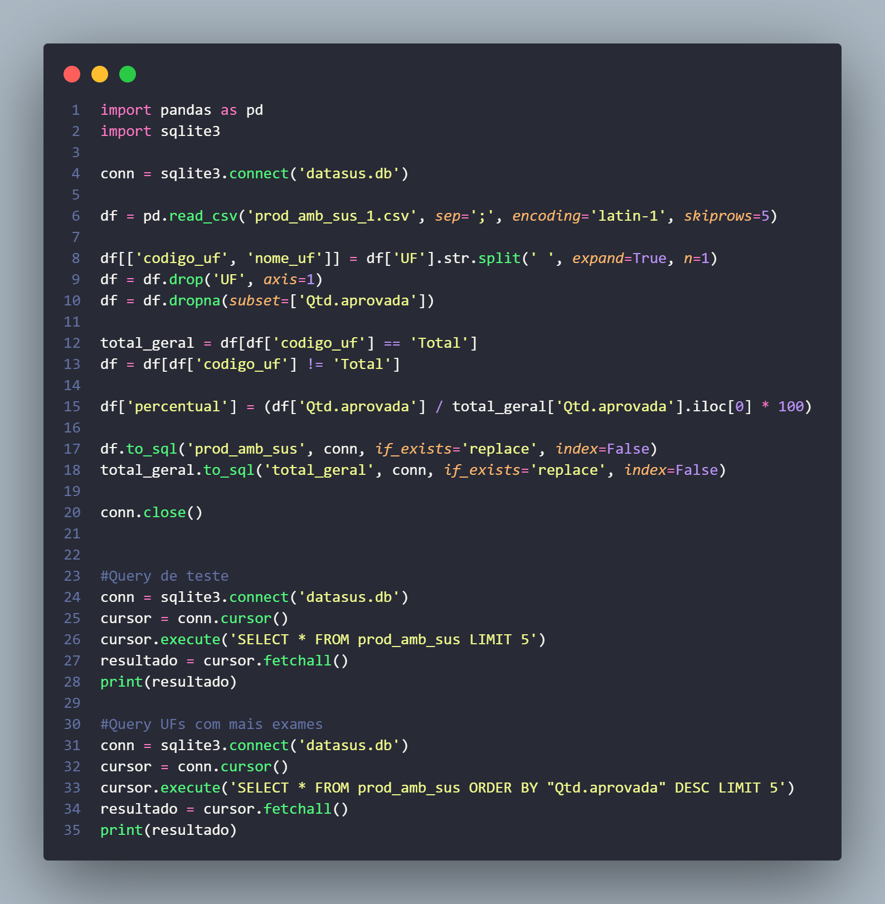
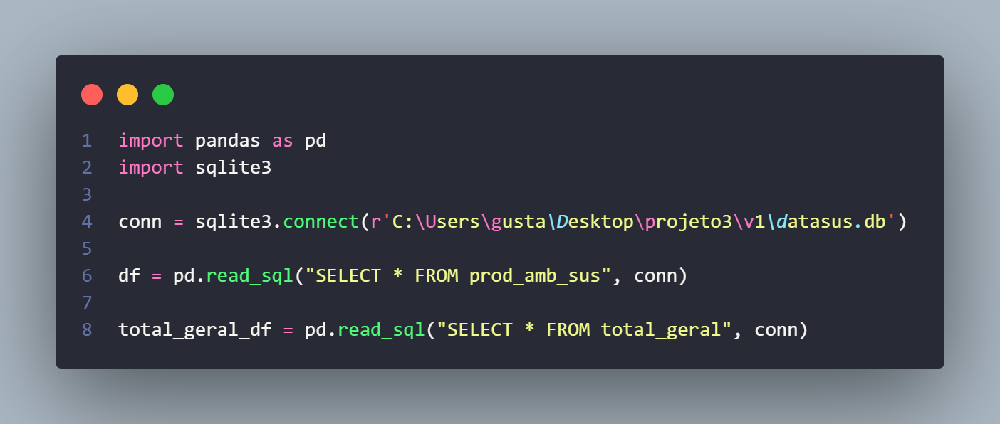
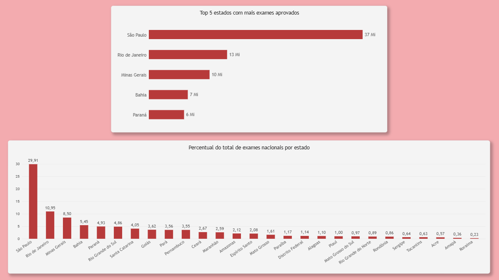

# Procedimentos de Imagem no SUS (v1)

Análise da produção ambulatorial de exames de imagem no SUS por UF, usando dados públicos do DataSUS (SIA/SUS).

## Objetivo

Levantar o volume de procedimentos diagnósticos por imagem (raio-X, ultrassonografia, tomografia, ressonância magnética e medicina nuclear in vivo) realizados em cada UF do Brasil, no ano de 2025, e identificar a distribuição desses exames entre estados.

## Fonte dos dados

- **Sistema**: TABNET (DataSUS) — Produção Ambulatorial do SUS (SIA/SUS), por local de atendimento, a partir de 2008
- **Grupo de procedimento**: 02 — Procedimentos com finalidade diagnóstica
- **Subgrupos incluídos**: Diagnóstico por radiologia, ultrassonografia, tomografia, ressonância magnética e medicina nuclear in vivo
- **Período**: janeiro a dezembro de 2025
- **Conteúdo extraído**: Qtd. aprovada, por UF

## Pipeline

1. **Extração**: exportação manual via TABNET em formato CSV (`;` como separador, encoding `latin-1`)
2. **Limpeza e transformação (Python/pandas)**:
   - Leitura do CSV pulando as linhas de cabeçalho descritivo
   - Separação da coluna `UF` em `codigo_uf` e `nome_uf`
   - Remoção das notas de rodapé do TABNET (linhas sem dado real)
   - Isolamento da linha de total nacional em uma tabela separada
   - Cálculo do percentual de cada UF em relação ao total nacional
3. **Carga**: dados salvos em um banco SQLite (`datasus.db`), em duas tabelas: `prod_amb_sus` (por UF) e `total_geral` (total nacional)
4. **Consulta**: queries SQL para identificar as 5 UFs com maior volume de exames e o percentual de cada UF sobre o total
5. **Visualização**: Power BI, conectado ao SQLite via script Python (`pd.read_sql`), com dois gráficos:
   - Barras horizontais: top 5 UFs em volume de exames
   - Colunas verticais: percentual de cada UF sobre o total nacional

**Script de extração, limpeza e carga no SQLite**


**Script de conexão do Power BI com o SQLite**


**Visualização final no Power BI**


## Tecnologias

Python, pandas, sqlite3, Power BI

## Limitações conhecidas (v1)

- Os dados representam apenas o **total agregado** de exames por UF, sem distinção entre os tipos de exame (raio-X, TC, RM, ultrassom, medicina nuclear)
- Não há corte por período dentro do ano (dado consolidado de 2025 inteiro)

## Próximos passos (v2)

- Reexportar os dados do TABNET usando "Subgrupo proced." como dimensão de coluna, permitindo cruzar UF com tipo de exame
- Investigar a proporção de cada tipo de exame por região

## Estrutura de arquivos

```
v1/
├── prod_amb_sus_1.csv     # dado bruto exportado do TABNET
├── datasus.db             # banco SQLite com os dados tratados
├── script.py              # extração, limpeza e carga no SQLite
└── README.md
```
